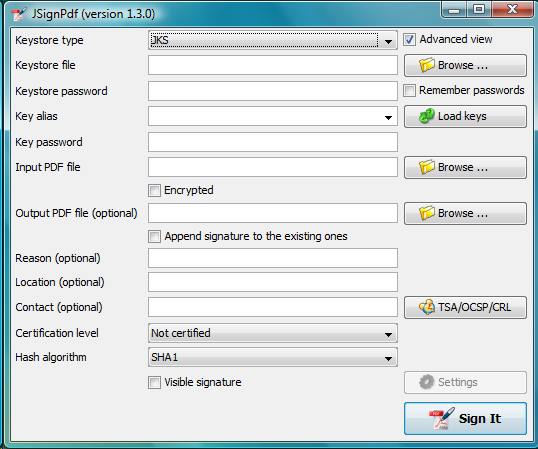
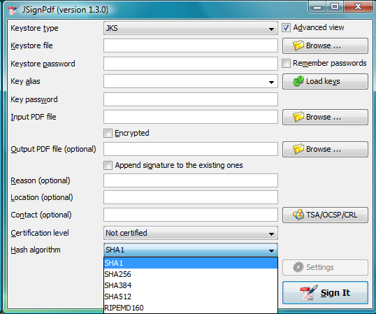
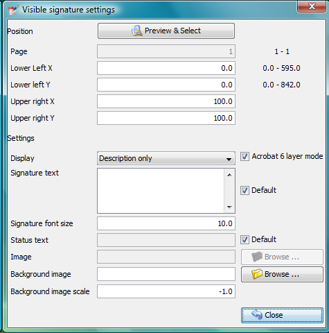

= JSignPdf Quick Start Guide
Josef Cacek
{jsignpdf-version}
:description: Digital signatures for your PDF documents
:doctype: book
:title-logo-image: image:img/jsignpdf-header.png[image,width=200,height=200,align=center]
:url-repo: https://github.com/intoolswetrust/jsignpdf

== JSignPdf Introduction

JSignPdf is an open-source application that adds digital signatures to PDF documents. It's written in Java programming language and it can be launched on the most of current OS. Users can control the application using simple GUI or command line arguments. Main features:

* supports visible signatures
* can set certification level
* supports PDF encryption with setting rights
* timestamp support
* certificate revocation checking (CRL and/or OCSP)

=== Benefits of digital signatures

Below are some common reasons for applying a digital signature to communications. (source Wikipedia)

==== Authentication

Although messages may often include information about the entity sending a message, that information may not be accurate. Digital signatures can be used to authenticate the source of messages. When ownership of a digital signature secret key is bound to a specific user, a valid signature shows that the message was sent by that user. The importance of high confidence in sender authenticity is especially obvious in a financial context. For example, suppose a bank's branch office sends instructions to the central office requesting a change in the balance of an account. If the central office is not convinced that such a message is truly sent from an authorized source, acting on such a request could be a grave mistake.

==== Integrity

In many scenarios, the sender and receiver of a message may require confidence that the message has not been altered during transmission. Although encryption hides the contents of a message, it may be possible to change an encrypted message without understanding it. (Some encryption algorithms, known as nonmalleable ones, prevent this, but others do not.) However, if a message is digitally signed, any change in the message will invalidate the signature. Furthermore, there is no efficient way to modify a message and its signature to produce a new message with a valid signature, because this is still considered to be computationally infeasible by most cryptographic hash functions

=== License

JSignPdf is released under LGPL and/or MPL license. It means, it can be freely used for both personal and commercial use. For details look directly to license files.

=== History

The project started at the beginning of 2008. It was switched to a maintenance-only mode in 2012. 

A greater change comes in 2021, where the project was switched to use the OpenPDF library instead of the old version of the iText library.

=== Author

The author of the JSignPdf is Czech developer Josef Cacek. He works in Java since 2000. Some links to Josef's projects:

* https://github.com/intoolswetrust/
* https://github.com/kwart/
* https://sourceforge.net/users/kwart/

=== Getting support

If you don't find the relevant information in this document or on the JSignPdf web page (http://jsignpdf.sourceforge.net/) use JSignPdf Google Group to ask the community.

https://groups.google.com/d/jsignpdf/[https://groups.google.com/d/jsignpdf/]

== Prerequisites

=== Java

If you want to use JSignPdf, and you don't install it on Windows using the installation program, you will need Java Runtime Environment (JRE) version 8 or newer. If you don't have it, you can download it freely from web pages, for instance:

https://www.azul.com/downloads/?package=jre#download-openjdk

=== Keystore

To sign PDF documents you need a keystore with your private key. The most common keystore types supported by Java are:

* PKCS#12 – keys stored in .p12 and .pfx files
* PKCS#11 – keys stored usually on hardware modules
* JKS (Java Key Store)
* WINDOWS-MY – supported only on MS Windows with Java 6 and newer. You can use directly your certificates imported into your system.

JSignPdf has been also extended to support external keystore types like smart cards, or network HSMs. The first example is CloudFoxy (https://gitlab.com/cloudfoxy).

== Launching

All platforms (with Java installed) should support the launching of jar file _JSignPdf.jar_. Use the following command in the directory, where the application is located.

$ java -jar JSignPdf.jar

== Using JSignPdf – signing PDF files

=== Simple version

Fill text fields and press the _Sign It_ button.

image:img/simple-view.png[image,width=263,height=162]

=== More detailed version

==== Select Key Store Type

The Keystore means the location where the private keys are located.

image:img/keystore-types.png[image,width=263,height=162]

By default, JSignPdf displays keystore types provided by Java Runtime itself and the Bouncy Castle cryptographic provider.

JSignPdf has been extended to support remote/external keystore types. The first entry is “CloudFoxy” (https://gitlab.com/cloudfoxy), which is a REST API for physical smart cards, initially developed to support eIDAS signatures.

==== Keystore file and password

If you use PKCS#12 or Java keystore types (JKS, JCEKS), you have to select the file where the keys are stored and provide the password of this file. Path to the keystore file can be inserted directly by typing or you can use the _Browse_ button to navigate through the file system with Open File Dialog.

==== Input and Output PDF files

_Input PDF file_ is an existing PDF file to which should be added digital signature.

_Output PDF file_ is the name of the result PDF file. If the value is not filled, automatically will be used the _Input PDF file_ with additional suffix “__signed_” (e.g. input _test.pdf_ will result in _test_signed.pdf_)

_*The Input and Output files have to be different!*_

==== Reason, location, contact

The reason, location, and contact fields provide additional information about the signature. Filled values will be stored in the result PDF.

==== Remember passwords

JSignPdf stores filled information when you are exiting the application, so it's present when you run it the next time. Passwords are not stored by default, but you can allow them by selecting checkbox _Remember passwords_.

_*Even if the password is stored in the encrypted form, we do not recommend storing passwords if your computer is used by more users!*_

==== Sign It

Button _Sign It_ starts the signing process. It displays a console window and you can see what the program is doing.

image:img/output-console-window.png[image,width=316,height=231]

=== Advanced view

If you are a more experienced user or you have to handle encrypted PDFs or you have more keys stored in your keystore, you can use the _Advanced view_ checkbox to enable additional functionality.

==== Key alias

When you have more private keys stored in the keystore, you can select which one will be used to sign the PDF file by filling the _Key alias_ field. Either you can type alias name directly (combo box is editable) or you can load all names by pressing the _Load keys_ button and then select one from the drop-down list.footnote:[Only the private keys, which are valid (at the time of the signing) are displayed in the list. If the certificate supports the Key Usage extension, the private key will only be displayed if it is meant for signing.]

If you don't fill the _Key alias_ field the first alias read from keystore will be used.

==== Key password

Each key in the keystore can be protected with its password. If this password differs from the password of keystore, fill it in the _Key password_ input field.

==== Append signature

JSignPdf can work in two signing modes. It replaces existing signatures with the new ones by default. If you select the _Append signature_ checkbox, the new one will be appended and the old signatures will stay unchanged. _*This option is disabled for encrypted documents.*_

==== Certification level

The JSignPdf application can add a certificate to the signed PDF. There are four levels of certification as you can see from the screenshot:

image:img/cert-level.png[image,width=338,height=282]

==== Hash algorithms

You can choose, which hash function will be used for the signature.

=== Encryption

__PDF Encryption __combobox enables additional fields for support of PDF security. By using this you can either sign secured PDFs (and change the rights and user password) or you can add encryption to unencrypted PDF during the signing.

==== Encryption: Passwords

Fill owner and user passwords to set it in secured result PDF. If the input PDF is encrypted, the _Owner password_ field has to match to owner password of the input PDF.

==== Encryption: Certificate

Fill the path to a certificate file (*.cer, *.crt, …) which should be used for the PDF encryption. Only the user, which has the private key for the certificate will be able to open the file.

==== Rights

You can set allowed actions in encrypted result PDF by pressing the _Rights_ button. A new modal window will be displayed and you can set the possible options there.

image:img/rights.png[image,width=155,height=106]

Normal rights are represented by checkboxes. Printing right has 3 levels, so the combo box is used for it.

=== Visible signature

Checkbox _Visible signature_ allows you to create a visible field with signature directly in the signed PDF. If the checkbox is checked, button _Settings_ is enabled and you can configure parameters (position/texts/images) of visible signature.

Read ToolTip texts, which are assigned to some input fields. You will get information, how to fill them correctly.

==== Page

Page number (counted from 1) to which the signature will be added.

==== Signature corners

Next four inputs __Lower Left (X, Y) __and _Upper Right (X, Y)_ define the position of the signature on the page. You can fill in float numbers (with decimal places) as input. If you have already selected input PDF in the main window you will see a possible range for X and Y values on the right side of _Lower Left (X, Y)_ input fields.

The position of a signature on the page is bounded by the lower-left corner and upper-right corner. The zero ([0,0]) position on the page is in the left bottom corner.

==== Preview / Select button

The PDF preview is supported from version 1.0.0. The borders of the visible signature are displayed on the chosen page. You can select a new position by pressing the left mouse button at the start corner, moving to the end corner, and releasing the mouse.

image:img/preview-select.png[image,width=347,height=402]

==== Display

In combo box _Display_ you can set which fields will be generated to visible signature.

==== Acrobat 6 layers

The checkbox _Acrobat 6 layer mode _(checked by default) allows you to control which signature layers will be added to the signed document. Acrobat 6.0 and higher recommends that only layers n2 and n4 be present. If the checkbox is not selected then all layers will be created.

==== Texts and Images

_Signature Text_, _Status Text_, _Image_, and _Background Image_ inputs define the content of fields in a visible signature. _Signature Font Size_ is used for setting the size of _Signature Text_, it should contain a positive decimal number.

_Background image scale_ defines the size of a background image. Any negative number means the best-fit algorithm will be used. Zero value means to stretch, which fills the whole field – it doesn't keep the image ratio. A positive value means the multiplicator of the original size.

=== TSA – timestamps

To add timestamp into signature you will need some timestamping authority (TSA). Fill server address into _TSA URL_ field and if the server requires authentication choose the authentication type and fill either _TSA User_ and _TSA Password_ fields or path to the certificate's private key (it has to be PKCS#12 keystore) and the password. You can also set _TSA Policy OID_, which will be sent to the TSA server in the request, but probably you will not need to do so and the server uses the right policy by itself.

image:img/tsa-settings.png[image,title="tsa-dialog-outdated-screenshot",width=234,height=217]

=== Certificate revocation checking

JSignPdf supports two standard ways of certificate revocation checking – CRL and OCSP. Most of the X.509 certificates support CRL, but it has some disadvantages (for instance the size of the list and possibly outdated information). The second – OCSP solves the mentioned issues, but not all Certification Authorities (CA) support this protocol.

==== CRL

RFC 3280, Internet X.509 Public Key Infrastructure, Certificate and Certificate Revocation List (CRL) Profile.

Wikipedia says: In the operation of some cryptosystems, usually public key infrastructures (PKIs), a certificate revocation list (CRL) is a list of certificates (or more specifically, a list of serial numbers for certificates) that have been revoked or are no longer valid, and therefore should not be relied upon.

Such a list will be downloaded from CA and stored in PDF during the signing process.

==== OCSP

RFC 2560, X.509 Internet PKI Online Certificate Status Protocol-OCSP.

Wikipedia says: The Online Certificate Status Protocol (OCSP) is an Internet protocol used for obtaining the revocation status of an X.509 digital certificate. It is described in RFC 2560 and is on the Internet standards track. It was created as an alternative to certificate revocation lists (CRL), specifically addressing certain problems associated with using CRLs in public key infrastructure (PKI). Messages communicated via OCSP are encoded in ASN.1 and are usually communicated over HTTP. The "request/response" nature of these messages leads to OCSP servers being termed OCSP responders.

If OCSP is enabled in JSignPdf and the protocol is supported for the certificate, the OCSP request will be created and the response will be stored in a signed PDF. The URL of the OCSP server is retrieved from the certificate. If the OCSP part is not found in the signing certificate, the value from the _default OCSP server URL_ field will be used.

=== Proxy settings

If some “online” feature (TSA, CRL, OCSP) is enabled and JSignPdf runs behind a firewall, you can set the proxy, which will be used for all internet connections. Proxy type DIRECT means no proxy will be used.

== Using hardware tokens for signing

Steps to sign documents using hardware tokens:

. Install PKCS#11 driver for your token. Check the vendor's documentation and install a proper driver for your system;
. Create a configuration file pkcs11.cfg somewhere on your system. It will be used to configure a Java SunPKCS11 security provider. (see https://docs.oracle.com/javase/8/docs/technotes/guides/security/p11guide.html) +
The content depends on your driver, you can try to start with a simple 2 lines: +
[source]
----
name=Test
library=/path/to/your/PKCSDriver.so
----
+
If it doesn't work, try to add
+
[source]
----
slotIndex=1
----
. Try to run JSignPdf with PKCS11 debug enabled:

[source]
----
java -Djava.security.debug=pkcs11keystore \
     -Djava.security.debug=sunpkcs11 \
     -jar JSignPdf.jar
----

If the PKCS11 keystore type works properly in the GUI and you can use the certificate on your token, you're ready to use it also in the batch mode.

[source]
----
java -jar JSignPdf.jar -kst PKCS11 -ksp 123456 document.pdf
----

== Advanced application configuration

Some advanced options are not controlled from GUI or the command line. They can be only set directly in the appropriate configuration file.

=== conf.properties

The property file _conf/conf.properties_ contain several option groups:

* visible signature font settings
* control the certificate checks
* PKCS#11 support
* enable more strict SSL handling

=== Java VM options using EXE launchers

If the Java VM properties have to be changed (e.g. maximum memory allowed) and the EXE wrapper is used, you can edit the appropriate _.l4j.ini_ file (e.g. _JSignPdf.l4j.ini_).

The arguments should be separated with spaces or newlines, environment variable expansion is supported, for example:

[source]
----
-Dswing.aatext=true
-Dsomevar="%SOMEVAR%"
-Xms32m
-Xmx512m
----

== Solving problems

=== Out of memory error

If you will see OutOfMemoryError in the program console, you need to allow java to use more memory.

Add -Xmx<size> switch to your java. Following example allows java to use 512MB (heap size).

[source]
----
$ java -Xmx512m -jar JSignPdf.jar
----

== Command line (batch mode)

[source,shell]
----
usage: java -jar JSignPdf.jar [file1.pdf [file2.pdf ...]] [-a] [--bg-path
       <file>] [--bg-scale <scale>] [-c <contact>] [-cl <level>] [--crl] [-d
       <path>] [--disable-acrobat6-layer-mode] [--disable-assembly]
       [--disable-copy] [--disable-fill] [--disable-modify-annotations]
       [--disable-modify-content] [--disable-screen-readers] [-e] [-ec <file>]
       [-fs <size>] [-h] [-ha <algorithm>] [--img-path <file>] [-ka <alias>]
       [-ki <index>] [-kp <password>] [-ksf <file>] [-ksp <password>] [-kst
       <type>] [-l <location>] [--l2-text <text>] [--l4-text <text>] [-lk]
       [-lkt] [-llx <position>] [-lly <position>] [-lp] [-lpf <file>] [--ocsp]
       [--ocsp-server-url <responderUrl>] [-op <prefix>] [-opwd <password>] [-os
       <suffix>] [-pe <mode>] [-pg <pageNumber>] [-pr <right>] [--proxy-host
       <hostname>] [--proxy-port <port>] [--proxy-type <type>] [-q] [-r
       <reason>] [--render-mode <mode>] [-ta <method>] [-ts <URL>]
       [--tsa-policy-oid <policyOID>] [-tscf <file>] [-tscp <password>] [-tsct
       <ks-type>] [-tsh <algorithm>] [-tsp <password>] [-tsu <username>] [-upwd
       <password>] [-urx <position>] [-ury <position>] [-v] [-V]
JSignpdf is an application designed to digitally sign PDF documents. If you
start the program without any command line argument, the GUI will be started,
otherwise you can use JSignPdf in command line batch mode.
 -a,--append                             add signature to existing ones. By
                                         default are existing signatures
                                         replaced by the new one.
    --bg-path <file>                     background image path for visible
                                         signatures
    --bg-scale <scale>                   background image scale for visible
                                         signatures. Insert positive value to
                                         multiply image size with the value.
                                         Insert zero value to fill whole
                                         background with it (stretch). Insert
                                         negative value to best fit resize.
 -c,--contact <contact>                  signer's contact details (a signature
                                         field)
 -cl,--certification-level <level>       level of certification. Default value
                                         is NOT_CERTIFIED. Available values are
                                         NOT_CERTIFIED,
                                         CERTIFIED_NO_CHANGES_ALLOWED,
                                         CERTIFIED_FORM_FILLING,
                                         CERTIFIED_FORM_FILLING_AND_ANNOTATIONS
    --crl                                enable CRL certificate validation
 -d,--out-directory <path>               folder in which the signed documents
                                         will be stored. Default value is
                                         current folder.
    --disable-acrobat6-layer-mode        disables the Acrobat 6 layer mode i.e.
                                         all signature layers will be created.
                                         Acrobat 6.0 and higher recommends that
                                         only layer n2 and n4 be present.
    --disable-assembly                   deny assembly in encrypted documents
    --disable-copy                       deny copy in encrypted documents
    --disable-fill                       deny fill encrypted documents
    --disable-modify-annotations         deny modify annotations in encrypted
                                         documents
    --disable-modify-content             deny modify content in encrypted
                                         documents
    --disable-screen-readers             deny screen readers in encrypted
                                         documents
 -e,--encrypted                          This property is deprecated, use
                                         -encryption PASSWORD instead!
 -ec,--encryption-certificate <file>     path to the certificate file, which is
                                         used to encrypt output PDF in case of
                                         -encryption CERTIFICATE
 -fs,--font-size <size>                  font size for visible signature text,
                                         default value is 10.0
 -h,--help                               prints this help screen
 -ha,--hash-algorithm <algorithm>        hash algorithm used for signature.
                                         Default value is SHA1. Available values
                                         are SHA1, SHA256, SHA384, SHA512,
                                         RIPEMD160
    --img-path <file>                    image path for visible signature
 -ka,--key-alias <alias>                 name (alias) of the key, which should
                                         be used for signing the document. If
                                         this option is not given, the first key
                                         in the keystore is used. (List the key
                                         aliases using -lk)
 -ki,--key-index <index>                 zero based index of the key, which
                                         should be used for signing the
                                         document. If neither this option nor
                                         alias is given, the first key (index=0)
                                         in the keystore is used. (List the key
                                         aliases using -lk). This option has
                                         lower priority than alias.
 -kp,--key-password <password>           password of the key in keystore. In
                                         most cases you don't need to set this
                                         option - only keystore is protected by
                                         a password, but just in case :)
 -ksf,--keystore-file <file>             sets KeyStore file - as the value use
                                         the path on which is file with private
                                         key(s) located (.p12, .pfx, .jks, ...).
                                         Some keystores haven't keys stored in a
                                         file (e.g. windows keystore -
                                         WINDOWS-MY), then don't use this
                                         option.
 -ksp,--keystore-password <password>     password to KeyStore
 -kst,--keystore-type <type>             sets KeyStore type (you can list
                                         possible values for this option -lkt
                                         argument)
 -l,--location <location>                location of a signatue (e.g. Washington
                                         DC). Empty by default.
    --l2-text <text>                     signature text, you can also use
                                         placeholders for signature properties
                                         (${signer}, ${timestamp}, ${location},
                                         ${reason}, ${contact})
    --l4-text <text>                     status text
 -lk,--list-keys                         lists keys in choosen keystore
 -lkt,--list-keystore-types              lists keystore types, which can be used
                                         as values -kst option
 -llx <position>                         lower left corner postion on X-axe of a
                                         visible signature
 -lly <position>                         lower left corner postion on Y-axe of a
                                         visible signature
 -lp,--load-properties                   Loads properties from a default file
                                         (created by GUI application).
 -lpf,--load-properties-file <file>      Loads properties from the given file.
                                         The file can be create by copying the
                                         default property file .JSignPdf created
                                         by the GUI in the user home directory.
    --ocsp                               enable OCSP certificate validation
    --ocsp-server-url <responderUrl>     default OCSP server URL, which will be
                                         used in case the signing certificate
                                         doesn't contain this information
 -op,--out-prefix <prefix>               prefix for signed file. Default value
                                         is empty prefix.
 -opwd,--owner-password <password>       owner password for encrypted documents
                                         (used when -e option is given)
 -os,--out-suffix <suffix>               suffix for signed filename. Default
                                         value is "_signed". (e.g. sign process
                                         on file mydocument.pdf will create new
                                         file mydocument_signed.pdf)
 -pe,--encryption <mode>                 encryption mode for the output PDF
                                         Default value is NONE. Possible values
                                         are NONE, PASSWORD, CERTIFICATE. Use
                                         togethter with -upwd and -opwd in case
                                         of PASSWORD mode, and -ec in case of
                                         CERTIFICATE
 -pg,--page <pageNumber>                 page with visible signature. Default
                                         value is 1 (first page). If the
                                         provided page number is out of bounds,
                                         then the last page is used.
 -pr,--print-right <right>               printing rights. Used for encrypted
                                         documents. Default value is
                                         ALLOW_PRINTING. Available values are
                                         DISALLOW_PRINTING,
                                         ALLOW_DEGRADED_PRINTING, ALLOW_PRINTING
    --proxy-host <hostname>              hostname or IP address of proxy server
    --proxy-port <port>                  port of proxy server, default value is
                                         80
    --proxy-type <type>                  proxy type for internet connections.
                                         Default value is DIRECT. Possible
                                         values are DIRECT, HTTP, SOCKS
 -q,--quiet                              quiet mode - without info messages
                                         during process
 -r,--reason <reason>                    reason of signature. Empty by default.
    --render-mode <mode>                 render mode for visible signatures.
                                         Default value is DESCRIPTION_ONLY.
                                         Possible values are DESCRIPTION_ONLY,
                                         GRAPHIC_AND_DESCRIPTION,
                                         SIGNAME_AND_DESCRIPTION
 -ta,--tsa-authentication <method>       authentication method used when
                                         contacting TSA server. Default value is
                                         NONE. Possible values are NONE,
                                         PASSWORD, CERTIFICATE
 -ts,--tsa-server-url <URL>              address of timestamping server (TSA).
                                         If you use this argument, the timestamp
                                         will be included to signature. (For
                                         testing purposes you can try following
                                         URL
                                         http://dse200.ncipher.com/TSS/HttpTspSe
                                         rver)
    --tsa-policy-oid <policyOID>         TSA policy OID which should be set to
                                         timestamp request.
 -tscf,--tsa-cert-file <file>            path to keystore file, which contains
                                         private key used to authentication
                                         against TSA server, when CERTIFICATE
                                         authentication method is used
 -tscp,--tsa-cert-password <password>    password used to open PKCS#12 file (see
                                         -tscf option) with a private key
 -tsct,--tsa-cert-file-type <ks-type>    keystore type for TSA CERTIFICATE
                                         authentication - the default is PKCS12
 -tsh,--tsa-hash-algorithm <algorithm>   hash algorithm used to in query to
                                         time-stamping server (TSA); the default
                                         is SHA-1
 -tsp,--tsa-password <password>          TSA user password. Use this switch if
                                         you use timestamping (-ts) and TSA
                                         server requires authentication.
 -tsu,--tsa-user <username>              TSA user name. Use this switch if you
                                         use timestamping (-ts) and TSA server
                                         requires authentication.
 -upwd,--user-password <password>        user password for encrypted documents
                                         (used when -e option is given)
 -urx <position>                         upper right corner postion on X-axe of
                                         a visible signature
 -ury <position>                         upper right corner postion on Y-axe of
                                         a visible signature
 -v,--version                            shows the application version
 -V,--visible-signature                  enables visible signature
----

=== Program exit codes

[cols=",",]
|=============================================================
|Code |Meaning
|0 |program finished without errors
|1 |command line is in a wrong format
|2 |no operation requested - e.g. no file for signing provided
|3 |signing of some, but not all, files failed
|4 |signing of all files failed
|=============================================================

=== Examples

[source]
----
$ java -jar JSignPdf.jar -kst WINDOWS-MY mydocument.pdf
-> creates copy of mydocument.pdf with name mydocument_signed.pdf, which is
digitally signed with the first certificate found in default windows certificate
store
------------
$ java -jar JSignPdf.jar -kst PKCS12 -ksf my_certificate.pfx -ksp
myPrivateKeystorePassword -ka cert23 -pe PASSWORD -opwd xxx123 -upwd 123xxx -pr
DISALLOW_PRINTING mydocument.pdf
-> creates signed and encrypted file mydocument_signed.pdf, printing of the new
file is not allowed. For signature is used key with alias cert23 from the file
my_certificate.pfx
------------
$ java -jar JSignPdf.jar -lkt
-> lists keystore types
------------
$ java -jar JSignPdf.jar -kst PKCS12 -ksf my_certificate.pfx -ksp
myVeryPrivatePassword -lk -q
-> list names (aliases) of keys stored in my_certificate.pfx file using the
password for keystore. Quiet mode is enabled so no debug info is printed.
----

== Other command line tools

=== InstallCert Tool

In some cases, when the JSignPdf connects to server through HTTPS protocol (e.g. to TSA server for timestamping), it can fail with console message “SSLHandshakeException”. It's caused because Java uses keystore (named “cacerts”) with preinstalled well-known certification authorities root certificates and if the HTTPS server doesn't have certificate signed by a such registered authority, the connection is refused.

If you trust the server, which was refused, you can add its certificate (or some parent certificate in the certificate chain) to the Java cacerts keystore. JSignPdf comes with command line utility for it – InstallCert.

[source]
----
Usage:

$java -jar InstallCert.jar

or

$java -jar InstallCert.jar hostname[:port] [cacertPwd]
----

If you don't provide a hostname argument, you will be asked for it.

image:img/installcert-tool.png[image,width=428,height=216]

The certificate chain will be displayed and you can choose which one will be imported.
  
