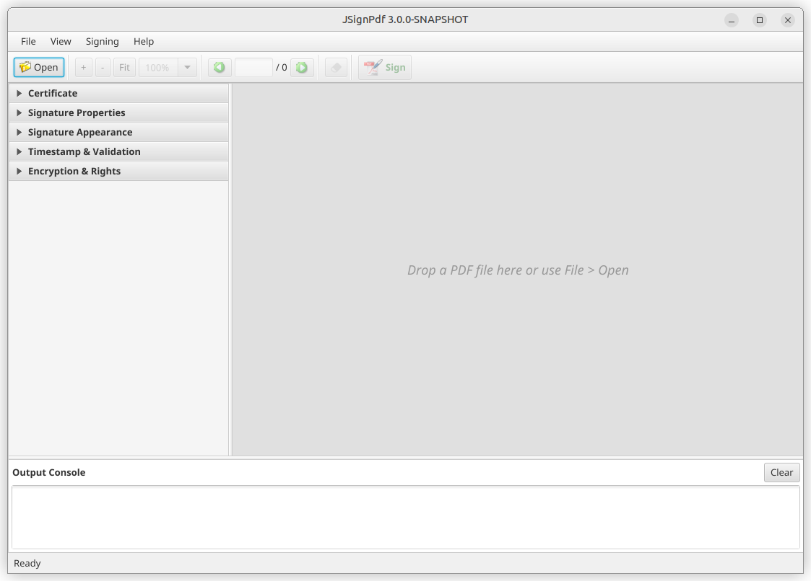
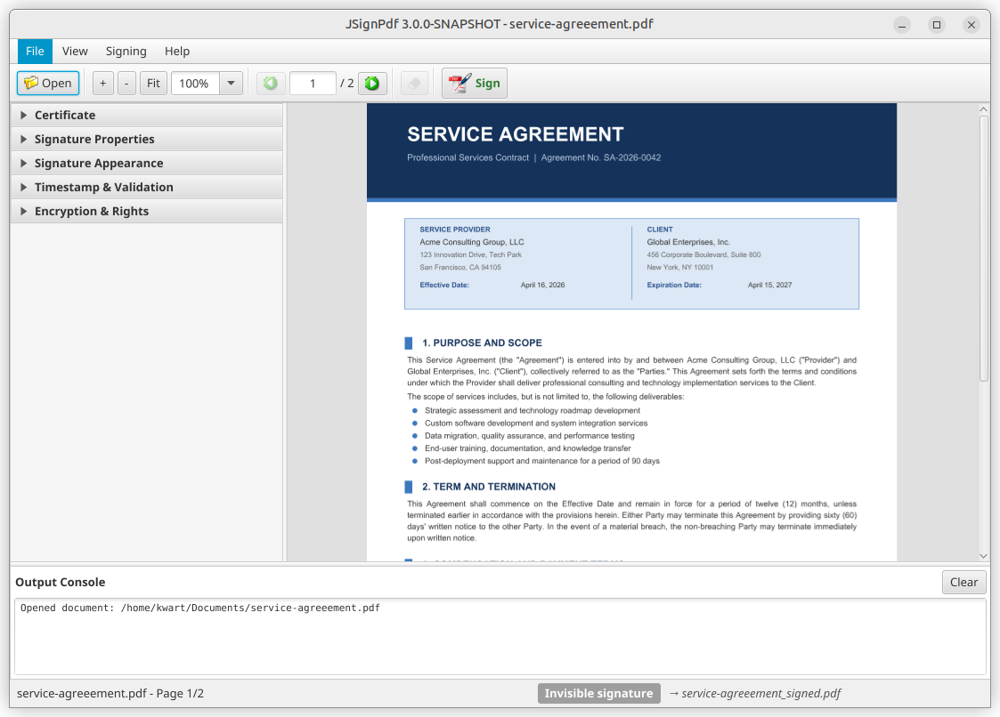
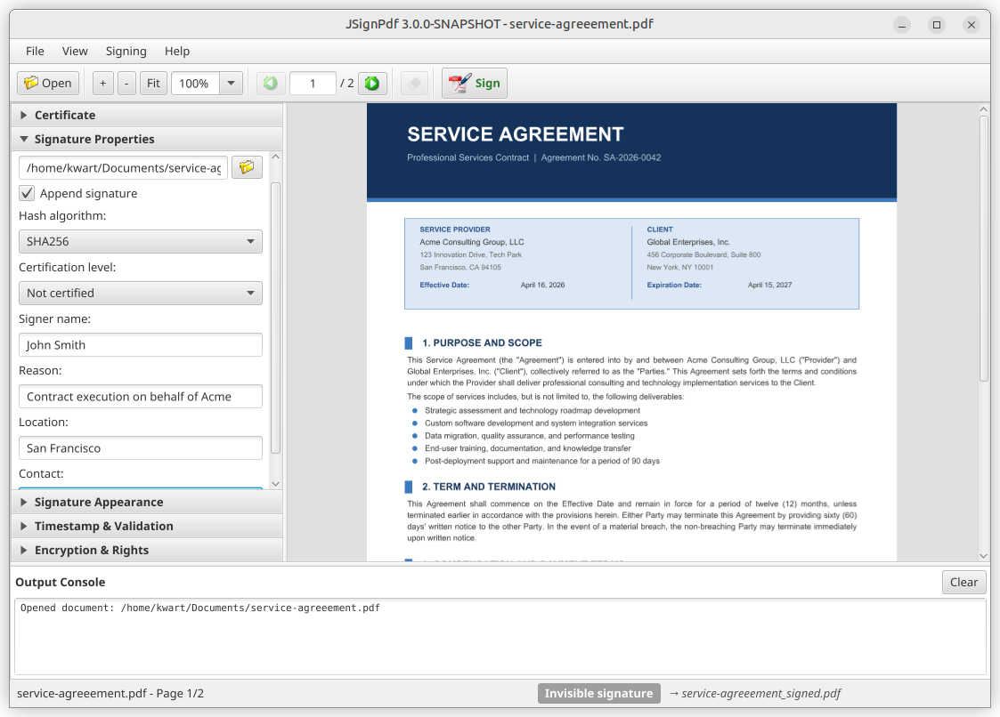
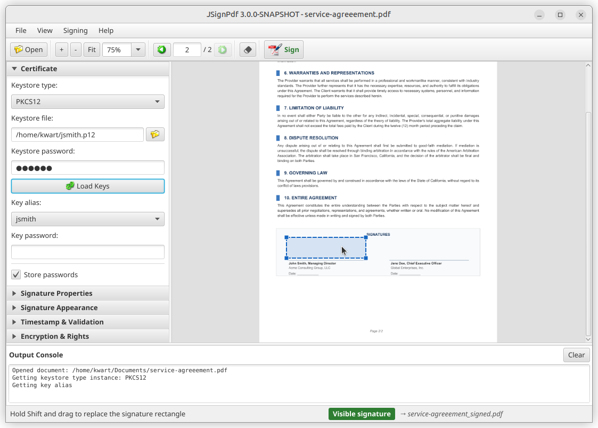
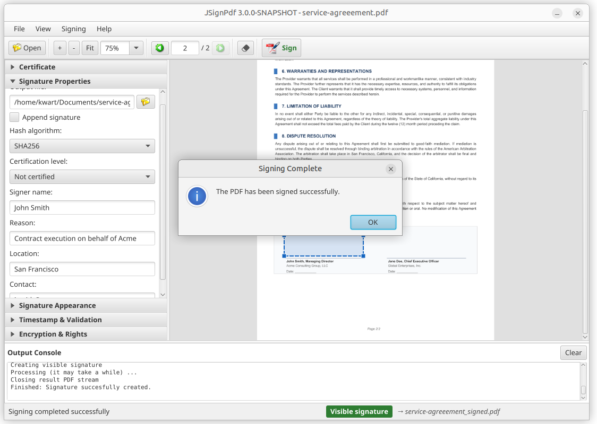
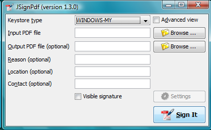
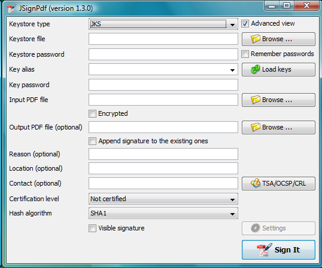
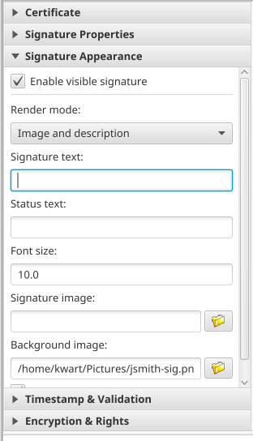
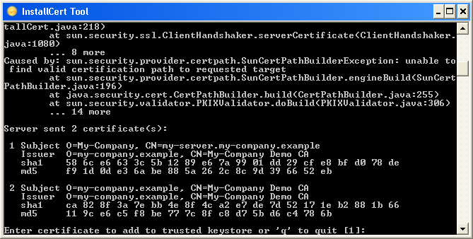

= JSignPdf User Guide
Josef (kwart) Cacek
{jsignpdf-version}
:description: Digital signatures for your PDF documents
:doctype: book
:title-logo-image: 
:url-repo: https://github.com/intoolswetrust/jsignpdf

== Introduction

JSignPdf is an open-source application that adds digital signatures to PDF documents. It's written in the Java programming language and can be launched on most current operating systems. Users can control the application using a modern JavaFX graphical interface, the classic Swing GUI, or command line arguments. Main features:

* supports visible signatures
* can set certification level
* supports PDF encryption with setting rights
* timestamp support
* certificate revocation checking (CRL and/or OCSP)

=== License

JSignPdf is released under LGPL and/or MPL license. It can be freely used for both personal and commercial use. For details look directly to the license files.

=== History

The project started at the beginning of 2008.

A greater change comes in 2021, where the project was switched to use the OpenPDF library instead of the old version of the iText library.

Starting with version 3.0.0, JSignPdf ships with a new document-centric JavaFX interface as the default graphical frontend. The classic Swing GUI remains available for backward compatibility.

=== Author

The author of JSignPdf is Czech developer Josef (kwart) Cacek. He works in Java since 2000. Some links to Josef's projects:

* https://github.com/intoolswetrust/
* https://github.com/kwart/

=== Getting support

If you don't find the relevant information in this document or on the JSignPdf GitHub page ({url-repo}), use the JSignPdf Google Group to ask the community.

https://groups.google.com/g/jsignpdf[JSignPdf Google Group]

== Installation and prerequisites

=== Downloading JSignPdf

JSignPdf releases are available on the GitHub releases page:

{url-repo}/releases

Each release provides the following artifacts:

[cols="1,3"]
|===
|Artifact |Description

|`jsignpdf-${VERSION}.zip`
|Platform-independent ZIP archive containing the JAR files (`JSignPdf.jar`, `InstallCert.jar`), a shell launcher for Linux/macOS, the documentation and the demo material. Works on any OS with Java 21 or newer installed.

|`JSignPdf-${VERSION}-win-x64.exe`
|Windows 64-bit EXE installer. Bundles its own Java runtime, installs to _Program Files_ by default, creates Start Menu shortcuts and registers an Add/Remove Programs entry.

|`JSignPdf-${VERSION}-win-x64.msi`
|Windows 64-bit MSI installer. Functionally equivalent to the EXE installer; preferred for deployment via group policy or enterprise software-distribution tools.

|`JSignPdf-${VERSION}-win-x64.zip`
|Windows 64-bit portable ZIP. Contains the fully packaged application (including a bundled JRE); just unzip and run `JSignPdf.exe`.
|===

NOTE: 32-bit Windows is no longer supported by the dedicated Windows installers. Users on 32-bit Windows can still run JSignPdf from the platform-independent ZIP with their own 32-bit JRE.

=== Java

If you use the platform-independent ZIP archive, you need Java Runtime Environment (JRE) version 11 or newer. You can download it freely from the web, for instance:

* https://adoptium.net/[Eclipse Adoptium]
* https://www.azul.com/downloads/?package=jre#download-openjdk[Azul Zulu]

NOTE: The Windows EXE / MSI / portable ZIP variants all bundle their own JRE, so a separate Java installation is not required on Windows.

=== Obtaining a keystore

To sign PDF documents you need a keystore containing your private key. If you don't have one yet:

* **For testing**, you can generate a self-signed certificate with the `keytool` utility that ships with Java: +
`keytool -genkeypair -alias mykey -keyalg RSA -keysize 2048 -keystore keystore.p12 -storetype PKCS12`
* **For production use**, obtain a certificate from a trusted Certificate Authority (CA). The CA will typically issue a PKCS#12 (`.p12` / `.pfx`) file.

The most common keystore types supported by Java are:

* PKCS#12 -- keys stored in `.p12` and `.pfx` files
* PKCS#11 -- keys stored usually on hardware modules (see <<Using hardware tokens for signing>>)
* JKS (Java Key Store)
* WINDOWS-MY -- supported on MS Windows. You can use directly your certificates imported into your system.

JSignPdf has been also extended to support external keystore types like smart cards, or network HSMs. The first example is CloudFoxy (https://gitlab.com/cloudfoxy).

=== Demo files

Every release bundles a small `demo/` folder so you can try JSignPdf immediately without generating your own certificate or finding a sample PDF:

[cols="1,3"]
|===
|File |Description

|`service-agreeement.pdf`
|Sample unsigned PDF document.

|`jsmith.p12`
|Demo PKCS#12 keystore with a self-signed certificate for `CN=John Smith`. The keystore and key password is `123456`.

|`README.md`
|Walk-through of the most common command-line scenarios (basic signature, visible signature, timestamped signature with FreeTSA, appending a signature, listing keys).
|===

You can find the folder:

* at the top level of the platform-independent ZIP (`jsignpdf-${VERSION}.zip`)
* under `<install dir>\app\demo\` after installing with the Windows EXE / MSI installer
* under `JSignPdf\app\demo\` in the Windows portable ZIP (`JSignPdf-${VERSION}-win-x64.zip`)

WARNING: The bundled keystore is meant purely for experimentation. Do not use it to sign real documents.

== Launching JSignPdf

=== From the Windows installer or portable ZIP

When JSignPdf is installed via the Windows EXE / MSI installer (or extracted from the `win-x64.zip` portable archive), four launchers are available:

[cols="1,3"]
|===
|Launcher |Purpose

|`JSignPdf.exe`
|Starts the JavaFX graphical interface (the default). Also available as a Start Menu shortcut after installation.

|`JSignPdf-swing.exe`
|Starts the classic Swing graphical interface (equivalent to passing `-Djsignpdf.swing=true` on the command line).

|`JSignPdfC.exe`
|Console-mode launcher for the signer. Use this in batch scripts, CI pipelines or whenever you want the output to appear in the current terminal window.

|`InstallCert.exe`
|Command-line tool for importing a server certificate into the bundled JRE's `cacerts` truststore (see <<InstallCert Tool>>).
|===

All four launchers share the bundled JRE -- you do **not** need to have Java installed separately. For installer-based deployments the launchers live in `<install dir>\` (with Start Menu shortcuts to the GUI launchers); in the portable ZIP they are directly in the extracted folder.

=== From the platform-independent ZIP

All platforms (with Java 21 or newer installed) can run the JAR file _JSignPdf.jar_ directly. Use the following command in the directory where the application is located:

 $ java -jar JSignPdf.jar

On Linux and macOS a convenience shell script is bundled in `bin/jsignpdf.sh` which adds the JVM options required on Java 21+ and then launches the JAR.

By default, JSignPdf opens the JavaFX graphical interface (see <<Using the JavaFX UI>>). To start the classic Swing GUI instead, set the `jsignpdf.swing` system property:

 $ java -Djsignpdf.swing=true -jar JSignPdf.jar

If command line arguments for signing are provided, JSignPdf runs in batch mode without opening any GUI (see <<Command line (batch mode)>>).

== Using the JavaFX UI

The JavaFX interface is the default graphical frontend for JSignPdf. It uses a document-centric workflow: you open a single PDF, configure the signature, and sign it. For signing multiple files in one go, use the <<Command line (batch mode),command line>>.

=== Opening a PDF document

When JSignPdf starts, the main window is empty and invites you to load a document. You can either drag and drop a PDF file onto the window or use _File > Open_ (or the _Open_ button in the toolbar).

Once a PDF is loaded, the document preview appears on the right, and the configuration panels on the left become active. The status bar at the bottom shows the file name and page count.

=== Configuring signature options

The left sidebar contains five collapsible panels that expose all signing options. Expand a panel by clicking its header.

* **Certificate** -- keystore type, keystore file & password, key alias & password (see <<Keystore selection>> and <<Key alias & key password>>)
* **Signature Properties** -- hash algorithm, certification level, append mode, reason / location / contact, input & output file paths (see <<Signing properties>>)
* **Signature Appearance** -- visible signature toggle, render mode, texts, images, font size (see <<Visible signature options>>)
* **Timestamp & Validation** -- TSA server, CRL, OCSP (see <<TSA -- timestamps>> and <<Certificate revocation checking>>)
* **Encryption & Rights** -- encryption mode, passwords, certificate, document rights (see <<Encryption>>)

At a minimum, you need to select a keystore and provide its password in the _Certificate_ panel. All other options have sensible defaults.

=== Placing a visible signature

To add a visible signature to the PDF, enable _Visible signature_ in the _Signature Appearance_ panel. You can then configure the render mode, signature text, status text, images, and font size.

To position the signature on the page, hold *Shift* and drag a rectangle directly on the document preview. The coordinates are updated automatically in the sidebar.

=== Signing the document

When you are ready, click the _Sign_ button in the toolbar. JSignPdf signs the document and displays the result in the Output Console at the bottom of the window.

The signed PDF is saved to the output path shown in the _Signature Properties_ panel. By default, it is the input file name with a `_signed` suffix (e.g. `document_signed.pdf`).

=== Using presets

A **preset** is a named bundle of signing settings that you can save once and reload with a single click. Presets are useful when you regularly switch between different configurations -- for example, one with a timestamp authority enabled and one without, or different visible-signature layouts for different document types.

Presets capture everything in the <<Signing options>> reference (keystore, signature properties, visible-signature options, TSA, encryption and rights, OCSP/CRL, proxy). Passwords are included only if _Store passwords_ is enabled at the time you save the preset; in that case they are encrypted with a machine-local seed tied to the current user account and are silently ignored on load if the preset file is used under a different `user.home`. If you want a preset without stored passwords, disable _Store passwords_ before saving — no password keys are written to the file in that case. Loading a preset without passwords also clears any passwords already entered in the UI, so switching to a password-less preset never silently reuses credentials from an earlier selection. The currently loaded input and output file paths are not part of a preset.

==== Loading a preset

The _Preset_ drop-down in the toolbar shows every saved preset, sorted by name. Picking an entry immediately loads its settings into the UI -- no confirmation, no extra click. After the load, the drop-down returns to its _Load preset..._ placeholder. There is no "currently active preset" tracked anywhere: the drop-down is just a launcher, and whatever you do after loading (edits, saving as a new preset, signing) is independent of the preset you came from.

If no presets exist yet, the drop-down is disabled and labelled _No presets saved_.

==== Saving a new preset

Choose _Presets > Save current as new preset..._ from the menu bar. Enter a name (up to 60 characters) and confirm. The preset appears in the toolbar drop-down immediately.

==== Managing existing presets

Choose _Presets > Manage presets..._ to open the management dialog. Each row offers three actions:

* **Rename** -- change the display name. The underlying file is not renamed; the name is stored inside the file.
* **Overwrite** -- replace the preset's stored settings with the current live settings. The preset's name and creation date are preserved. Asks for confirmation because the previous contents are lost.
* **Delete** -- remove the preset file. Asks for confirmation.

Presets are plain Java properties files under the <<Configuration directory,configuration directory>>.

== Classic Swing UI

The classic Swing GUI is the original graphical interface from earlier versions of JSignPdf. It remains available for backward compatibility. To start it, set the `jsignpdf.swing` system property:

 $ java -Djsignpdf.swing=true -jar JSignPdf.jar

The Swing GUI opens in a simplified view. Fill in the keystore type, keystore file and password, the input PDF file, and press _Sign It_.

Select the _Advanced view_ checkbox to access additional options such as key alias, append signature, certification level, hash algorithm, encryption, visible signature, TSA, and certificate revocation settings.

All options available in the Swing GUI correspond to the options described in the <<Signing options>> chapter.

== Command line (batch mode)

JSignPdf can be used in batch mode to sign one or more PDF files from the command line. This is useful for scripting and for signing multiple files at once.

The options are grouped by category below. For detailed descriptions of each option, see the <<Signing options>> chapter.

[source,shell]
----
usage: java -jar JSignPdf.jar [file1.pdf [file2.pdf ...]] [-a] [--bg-path
       <file>] [--bg-scale <scale>] [-c <contact>] [-cl <level>] [--crl] [-d
       <path>] [--disable-acrobat6-layer-mode] [--disable-assembly]
       [--disable-copy] [--disable-fill] [--disable-modify-annotations]
       [--disable-modify-content] [--disable-screen-readers] [-e] [-ec <file>]
       [--enable-stdin-passwords] [-fs <size>] [--gui] [-h] [-ha <algorithm>]
       [--img-path <file>] [-ka <alias>]
       [-ki <index>] [-kp <password>] [-ksf <file>] [-ksp <password>] [-kst
       <type>] [-l <location>] [--l2-text <text>] [--l4-text <text>] [-lk]
       [-lkt] [-llx <position>] [-lly <position>] [-lp] [-lpf <file>] [--ocsp]
       [--ocsp-server-url <responderUrl>] [-op <prefix>] [-opwd <password>] [-os
       <suffix>] [-pe <mode>] [-pg <pageNumber>] [-pr <right>] [--proxy-host
       <hostname>] [--proxy-port <port>] [--proxy-type <type>] [-q] [-r
       <reason>] [--render-mode <mode>] [-sn <signer>] [-ta <method>] [-ts <URL>]
       [--tsa-policy-oid <policyOID>] [-tscf <file>] [-tscp <password>] [-tsct
       <ks-type>] [-tsh <algorithm>] [-tsp <password>] [-tsu <username>] [-upwd
       <password>] [-urx <position>] [-ury <position>] [-v] [-V]
----

=== General options

[cols="1,3"]
|===
|Option |Description

| `-h, --help`
| Prints the help screen.

| `-v, --version`
| Shows the application version.

| `-q, --quiet`
| Quiet mode -- suppresses info messages during signing.

| `--gui`
| (Beta) Show the GUI even when other command line arguments are provided.

| `-lkt, --list-keystore-types`
| Lists available keystore types (use as values for `-kst`).

| `-lk, --list-keys`
| Lists keys in the chosen keystore.

| `-lp, --load-properties`
| Loads properties from the default file (created by the GUI application).

| `-lpf, --load-properties-file <file>`
| Loads properties from the given file. The file can be created by copying the default `config.properties` from the <<Configuration directory>>.

| `--enable-stdin-passwords`
| Allow reading password values from standard input. When set, a password option value of `-` means "read one line from stdin" (or prompt, on an interactive console). See <<Reading passwords from standard input>>.
|===

=== Keystore and key options

See <<Keystore selection>> and <<Key alias & key password>> for details.

[cols="1,3"]
|===
|Option |Description

| `-kst, --keystore-type <type>`
| Sets the keystore type. Use `-lkt` to list available types.

| `-ksf, --keystore-file <file>`
| Path to the keystore file (`.p12`, `.pfx`, `.jks`, ...). Not needed for keystores without files (e.g. `WINDOWS-MY`).

| `-ksp, --keystore-password <password>`
| Password for the keystore. Use `-` to read from stdin (requires `--enable-stdin-passwords`).

| `-ka, --key-alias <alias>`
| Name (alias) of the key to use for signing. If not given, the first key in the keystore is used. Use `-lk` to list available aliases.

| `-ki, --key-index <index>`
| Zero-based index of the key to use. Lower priority than `-ka`.

| `-kp, --key-password <password>`
| Password for the individual key (if different from the keystore password). Use `-` to read from stdin (requires `--enable-stdin-passwords`).
|===

=== Signature options

See <<Signing properties>> for details.

[cols="1,3"]
|===
|Option |Description

| `-a, --append`
| Append signature to existing ones instead of replacing them.

| `-ha, --hash-algorithm <algorithm>`
| Hash algorithm for the signature. Default: `SHA1`. Values: `SHA1`, `SHA256`, `SHA384`, `SHA512`, `RIPEMD160`.

| `-cl, --certification-level <level>`
| Certification level. Default: `NOT_CERTIFIED`. Values: `NOT_CERTIFIED`, `CERTIFIED_NO_CHANGES_ALLOWED`, `CERTIFIED_FORM_FILLING`, `CERTIFIED_FORM_FILLING_AND_ANNOTATIONS`.

| `-sn, --signer-name <signer>`
| Signer name. Defaults to the common name (CN) of the chosen certificate.

| `-r, --reason <reason>`
| Reason for the signature. Empty by default.

| `-l, --location <location>`
| Location of the signature (e.g. Washington DC). Empty by default.

| `-c, --contact <contact>`
| Signer's contact details.
|===

=== Output options

[cols="1,3"]
|===
|Option |Description

| `-d, --out-directory <path>`
| Folder for signed documents. Default: current folder.

| `-op, --out-prefix <prefix>`
| Prefix for the signed filename. Default: empty.

| `-os, --out-suffix <suffix>`
| Suffix for the signed filename. Default: `_signed` (e.g. `mydocument.pdf` becomes `mydocument_signed.pdf`).
|===

=== Visible signature options

See <<Visible signature options>> for details.

[cols="1,3"]
|===
|Option |Description

| `-V, --visible-signature`
| Enables a visible signature.

| `-pg, --page <pageNumber>`
| Page for the visible signature. Default: `1`. If out of bounds, the last page is used.

| `-llx <position>`
| Lower left corner X-axis position (negative value is subtracted from page width).

| `-lly <position>`
| Lower left corner Y-axis position (negative value is subtracted from page height).

| `-urx <position>`
| Upper right corner X-axis position (negative value is subtracted from page width).

| `-ury <position>`
| Upper right corner Y-axis position (negative value is subtracted from page height).

| `--render-mode <mode>`
| Render mode. Default: `DESCRIPTION_ONLY`. Values: `DESCRIPTION_ONLY`, `GRAPHIC_AND_DESCRIPTION`, `SIGNAME_AND_DESCRIPTION`.

| `--l2-text <text>`
| Signature text. Supports placeholders: `${signer}`, `${certificate}`, `${timestamp}`, `${location}`, `${reason}`, `${contact}`.

| `--l4-text <text>`
| Status text.

| `-fs, --font-size <size>`
| Font size for signature text. Default: `10.0`.

| `--img-path <file>`
| Image path for the visible signature.

| `--bg-path <file>`
| Background image path for the visible signature.

| `--bg-scale <scale>`
| Background image scale. Positive: multiply size. Zero: stretch to fill. Negative: best-fit resize.

| `--disable-acrobat6-layer-mode`
| Disable Acrobat 6 layer mode (creates all signature layers instead of just n2 and n4).
|===

=== Encryption and rights options

See <<Encryption>> for details.

[cols="1,3"]
|===
|Option |Description

| `-pe, --encryption <mode>`
| Encryption mode. Default: `NONE`. Values: `NONE`, `PASSWORD`, `CERTIFICATE`. Use together with `-upwd` and `-opwd` for `PASSWORD` mode, or `-ec` for `CERTIFICATE` mode.

| `-e, --encrypted`
| _Deprecated._ Use `-pe PASSWORD` instead.

| `-opwd, --owner-password <password>`
| Owner password for encrypted documents. Use `-` to read from stdin (requires `--enable-stdin-passwords`).

| `-upwd, --user-password <password>`
| User password for encrypted documents. Use `-` to read from stdin (requires `--enable-stdin-passwords`).

| `-ec, --encryption-certificate <file>`
| Path to certificate file for `CERTIFICATE` encryption.

| `-pr, --print-right <right>`
| Printing rights. Default: `ALLOW_PRINTING`. Values: `DISALLOW_PRINTING`, `ALLOW_DEGRADED_PRINTING`, `ALLOW_PRINTING`.

| `--disable-copy`
| Deny copy in encrypted documents.

| `--disable-assembly`
| Deny assembly in encrypted documents.

| `--disable-fill`
| Deny fill in encrypted documents.

| `--disable-modify-annotations`
| Deny modifying annotations in encrypted documents.

| `--disable-modify-content`
| Deny modifying content in encrypted documents.

| `--disable-screen-readers`
| Deny screen readers in encrypted documents.
|===

=== TSA and certificate validation options

See <<TSA -- timestamps>> and <<Certificate revocation checking>> for details.

[cols="1,3"]
|===
|Option |Description

| `-ts, --tsa-server-url <URL>`
| Address of the timestamping server (TSA). Enables timestamping.

| `-ta, --tsa-authentication <method>`
| TSA authentication method. Default: `NONE`. Values: `NONE`, `PASSWORD`, `CERTIFICATE`.

| `-tsu, --tsa-user <username>`
| TSA username (for `PASSWORD` authentication).

| `-tsp, --tsa-password <password>`
| TSA password (for `PASSWORD` authentication). Use `-` to read from stdin (requires `--enable-stdin-passwords`).

| `-tscf, --tsa-cert-file <file>`
| Path to keystore file with private key for TSA `CERTIFICATE` authentication.

| `-tscp, --tsa-cert-password <password>`
| Password for the TSA certificate keystore. Use `-` to read from stdin (requires `--enable-stdin-passwords`).

| `-tsct, --tsa-cert-file-type <ks-type>`
| Keystore type for TSA certificate authentication. Default: `PKCS12`.

| `-tsh, --tsa-hash-algorithm <algorithm>`
| Hash algorithm for TSA queries. Default: `SHA-1`.

| `--tsa-policy-oid <policyOID>`
| TSA policy OID to include in the timestamp request.

| `--ocsp`
| Enable OCSP certificate validation.

| `--ocsp-server-url <responderUrl>`
| Default OCSP server URL (used when the signing certificate doesn't contain one).

| `--crl`
| Enable CRL certificate validation.
|===

=== Proxy options

See <<Proxy settings>> for details.

[cols="1,3"]
|===
|Option |Description

| `--proxy-type <type>`
| Proxy type. Default: `DIRECT`. Values: `DIRECT`, `HTTP`, `SOCKS`.

| `--proxy-host <hostname>`
| Hostname or IP address of the proxy server.

| `--proxy-port <port>`
| Port of the proxy server. Default: `80`.
|===

=== Program exit codes

[cols="1,3"]
|===
|Code |Meaning

|0
|Program finished without errors.

|1
|Command line is in a wrong format.

|2
|No operation requested -- e.g. no file for signing provided.

|3
|Signing of some, but not all, files failed.

|4
|Signing of all files failed.

|5
|Input file cannot be read.

|6
|Common error.
|===

=== Examples

Sign a PDF using the Windows certificate store:

[source,shell]
----
$ java -jar JSignPdf.jar -kst WINDOWS-MY mydocument.pdf
----

Sign and encrypt a PDF, disabling printing:

[source,shell]
----
$ java -jar JSignPdf.jar -kst PKCS12 -ksf my_certificate.pfx \
  -ksp myPrivateKeystorePassword -ka cert23 \
  -pe PASSWORD -opwd xxx123 -upwd 123xxx \
  -pr DISALLOW_PRINTING mydocument.pdf
----

List available keystore types:

[source,shell]
----
$ java -jar JSignPdf.jar -lkt
----

List key aliases in a keystore (quiet mode):

[source,shell]
----
$ java -jar JSignPdf.jar -kst PKCS12 -ksf my_certificate.pfx \
  -ksp myVeryPrivatePassword -lk -q
----

=== Reading passwords from standard input

Passing a password on the command line exposes it to every local process that can read `/proc/<pid>/cmdline` (and to shell history). To avoid that, JSignPdf can read password values from standard input (or, in an interactive terminal, from the console) instead.

Opt in with `--enable-stdin-passwords` and use `-` as the value of any password option. Any of the six password options can use the sentinel: `-ksp`, `-kp`, `-opwd`, `-upwd`, `-tscp`, `-tsp`.

.Single password, piped from the environment
[source,shell]
----
$ printf '%s\n' "$KS_PASSWORD" \
  | java -jar JSignPdf.jar --enable-stdin-passwords \
      -kst PKCS12 -ksf keystore.p12 -ksp - -ka mykey \
      -d out/ input.pdf
----

When more than one option uses `-`, the values are consumed from stdin in a *fixed canonical order* regardless of the order in which they appear on the command line:

. `--keystore-password` (`-ksp`)
. `--key-password` (`-kp`)
. `--owner-password` (`-opwd`)
. `--user-password` (`-upwd`)
. `--tsa-cert-password` (`-tscp`)
. `--tsa-password` (`-tsp`)

.Keystore password first, then TSA password -- even though the CLI lists them in the other order
[source,shell]
----
$ { printf '%s\n' "$KS_PASSWORD"; printf '%s\n' "$TSA_PASSWORD"; } \
  | java -jar JSignPdf.jar --enable-stdin-passwords \
      -kst PKCS12 -ksf keystore.p12 -ksp - -ka mykey \
      -ts https://tsa.example/ -tsu tsauser -tsp - \
      -d out/ input.pdf
----

Before blocking on each read, JSignPdf prints a progress line such as `[jsignpdf] Reading password for --keystore-password (1/2) from stdin...` to _stderr_ so you can verify the order matches what your pipe is feeding. Use `-q` / `--quiet` to suppress it.

When a console is attached (an interactive terminal), `-` switches to a prompted, no-echo read via `java.io.Console.readPassword`:

[source,shell]
----
$ java -jar JSignPdf.jar --enable-stdin-passwords \
      -kst PKCS12 -ksf keystore.p12 -ksp - -ka mykey input.pdf
Enter password for --keystore-password: ****
----

[NOTE]
====
Without `--enable-stdin-passwords`, a literal `-` is still accepted as a password value (backwards compatible). JSignPdf will emit a one-time warning naming the flag, so a typo does not silently turn into a `-` password. The warning is suppressed by `-q`.
====

[NOTE]
====
Only exactly `-` is the stdin sentinel -- values such as `-abc` or `abc-` are treated as literal passwords. Note that Apache Commons CLI intercepts a bare `--` as the end-of-options marker before JSignPdf sees it, so `--` itself cannot be used as a literal password via `-ksp --`; this is a parser limitation.
====

== Signing options

This chapter describes all signing options in detail. The options are the same regardless of which interface you use (JavaFX GUI, Swing GUI, or command line). In the JavaFX interface the options are organized into sidebar panels; the corresponding panel name is noted in each section header.

=== Keystore selection

_JavaFX panel: Certificate_

The Keystore means the location where the private keys are located.

By default, JSignPdf displays keystore types provided by Java Runtime itself and the Bouncy Castle cryptographic provider.

JSignPdf has been extended to support remote/external keystore types. The first entry is "CloudFoxy" (https://gitlab.com/cloudfoxy), which is a REST API for physical smart cards, initially developed to support eIDAS signatures.

If you use PKCS#12 or Java keystore types (JKS, JCEKS), you have to select the file where the keys are stored and provide the password of this file. Path to the keystore file can be inserted directly by typing or you can use the browse button to navigate through the file system with Open File Dialog.

=== Key alias & key password

_JavaFX panel: Certificate_

When you have more private keys stored in the keystore, you can select which one will be used to sign the PDF file by filling the _Key alias_ field. Either you can type alias name directly (combo box is editable) or you can load all names by pressing the _Load keys_ button and then select one from the drop-down list.footnote:[Only the private keys, which are valid (at the time of the signing) are displayed in the list. If the certificate supports the Key Usage extension, the private key will only be displayed if it is meant for signing.]

If you don't fill the _Key alias_ field the first alias read from keystore will be used.

Each key in the keystore can be protected with its password. If this password differs from the password of keystore, fill it in the _Key password_ input field.

=== Signing properties

_JavaFX panel: Signature Properties_

==== Input and output PDF files

_Input PDF file_ is the existing PDF file to which a digital signature will be added.

_Output PDF file_ is the name of the resulting PDF file. If not specified, the _Input PDF file_ name with the suffix `_signed` is used automatically (e.g. input _test.pdf_ will produce _test_signed.pdf_)

_*The Input and Output files have to be different!*_

==== Reason, location, contact

The reason, location, and contact fields provide additional information about the signature. Filled values will be stored in the result PDF.

==== Append signature

JSignPdf can work in two signing modes. When _Append signature_ is enabled, the new signature is appended and any previously-existing signatures stay unchanged; when it is disabled, existing signatures are replaced. The GUI enables _Append signature_ by default; on the CLI the default is replace (pass `-a` to append). _*This option is disabled for encrypted documents.*_

==== Certification level

The JSignPdf application can add a certificate to the signed PDF. There are four levels of certification:

* NOT_CERTIFIED
* CERTIFIED_NO_CHANGES_ALLOWED
* CERTIFIED_FORM_FILLING
* CERTIFIED_FORM_FILLING_AND_ANNOTATIONS

==== Hash algorithms

You can choose which hash function will be used for the signature. Available algorithms include SHA-256, SHA-384, SHA-512, and others.

==== Remember passwords

JSignPdf stores filled information when you are exiting the application, so it's present when you run it the next time. Passwords are stored (encrypted) when the _Remember passwords_ option (labelled _Store passwords_ in the JavaFX GUI) is enabled. The option is enabled by default; uncheck it if you prefer to re-enter passwords on every launch.

_*Even if the password is stored in the encrypted form, we do not recommend storing passwords if your computer is used by more users!*_

=== Encryption

_JavaFX panel: Encryption & Rights_

The _Encryption_ option enables additional fields for support of PDF security. By using this you can either sign secured PDFs (and change the rights and user password) or you can add encryption to unencrypted PDF during the signing.

==== Encryption: Passwords

Fill owner and user passwords to set it in secured result PDF. If the input PDF is encrypted, the _Owner password_ field has to match to owner password of the input PDF.

==== Encryption: Certificate

Fill the path to a certificate file (*.cer, *.crt, ...) which should be used for the PDF encryption. Only the user who has the private key for the certificate will be able to open the file.

==== Rights

You can set allowed actions in encrypted result PDF by configuring the document rights. Normal rights are represented by checkboxes. Printing right has 3 levels, so the combo box is used for it.

=== Visible signature options

_JavaFX panel: Signature Appearance_

Enabling the _Visible signature_ option allows you to create a visible field with signature directly in the signed PDF. You can configure parameters (position/texts/images) of the visible signature.

==== Page

Page number (counted from 1) to which the signature will be added.

==== Signature corners

The four inputs _Lower Left (X, Y)_ and _Upper Right (X, Y)_ define the position of the signature on the page. You can fill in float numbers (with decimal places) as input. Negative values are subtracted from the page width (for X) or height (for Y), allowing you to position the signature relative to the right or top edge.

The zero ([0,0]) position on the page is in the left bottom corner.

In the JavaFX interface you can place the signature visually by holding Shift and dragging a rectangle on the document preview.

==== Display

In the _Display_ / _Render mode_ option you can set which fields will be generated to visible signature.

==== Acrobat 6 layers

The _Acrobat 6 layer mode_ option (enabled by default) allows you to control which signature layers will be added to the signed document. Acrobat 6.0 and higher recommends that only layers n2 and n4 be present. If the option is disabled then all layers will be created.

==== Texts and Images

_Signature Text_, _Status Text_, _Image_, and _Background Image_ inputs define the content of fields in a visible signature. _Font Size_ is used for setting the size of _Signature Text_, it should contain a positive decimal number.

_Background image scale_ defines the size of a background image. Any negative number means the best-fit algorithm will be used. Zero value means to stretch, which fills the whole field -- it doesn't keep the image ratio. A positive value means the multiplicator of the original size.

Supported file formats for the _Image_ and _Background Image_ are GIF, JPEG, JPEG2000, PNG, WMF, BMP, and TIFF.

=== TSA -- timestamps

_JavaFX panel: Timestamp & Validation_

To add a timestamp to the signature you will need a timestamping authority (TSA). Fill the server address into the _TSA URL_ field and if the server requires authentication, choose the authentication type and fill either the _TSA User_ and _TSA Password_ fields or the path to the certificate's private key (it has to be a PKCS#12 keystore) and the password. You can also set _TSA Policy OID_, which will be sent to the TSA server in the request, but typically the server uses the right policy by itself.

=== Certificate revocation checking

_JavaFX panel: Timestamp & Validation_

JSignPdf supports two standard ways of certificate revocation checking -- CRL and OCSP. Most X.509 certificates support CRL, but it has some disadvantages (for instance the size of the list and possibly outdated information). OCSP solves these issues, but not all Certification Authorities (CA) support it.

==== CRL

A Certificate Revocation List (CRL) is a list of serial numbers for certificates that have been revoked or are no longer valid (RFC 5280). When CRL checking is enabled in JSignPdf, the revocation list is downloaded from the CA and embedded in the signed PDF.

==== OCSP

The Online Certificate Status Protocol (OCSP) allows real-time verification of a certificate's revocation status (RFC 6960). Unlike CRL, which requires downloading a potentially large list, OCSP queries the CA for the status of a single certificate.

If OCSP is enabled in JSignPdf and the protocol is supported for the certificate, the OCSP request will be created and the response will be stored in the signed PDF. The URL of the OCSP server is retrieved from the certificate. If the OCSP part is not found in the signing certificate, the value from the _default OCSP server URL_ field will be used.

=== Proxy settings

If some "online" feature (TSA, CRL, OCSP) is enabled and JSignPdf runs behind a firewall, you can set the proxy, which will be used for all internet connections. Proxy type DIRECT means no proxy will be used.

== Using hardware tokens for signing

Steps to sign documents using hardware tokens:

. Install PKCS#11 driver for your token. Check the vendor's documentation and install a proper driver for your system;
. Create a configuration file pkcs11.cfg somewhere on your system. It will be used to configure a Java SunPKCS11 security provider. (see https://docs.oracle.com/en/java/javase/11/security/pkcs11-reference-guide1.html[PKCS#11 Reference Guide]) +
The content depends on your driver, you can try to start with a simple 2 lines: +
[source]
----
name=Test
library=/path/to/your/PKCSDriver.so
----
. Try to run JSignPdf with PKCS11 debug enabled:

[source]
----
java -Djava.security.debug=pkcs11keystore \
     -Djava.security.debug=sunpkcs11 \
     -jar JSignPdf.jar
----

If it doesn't work, try to add parameter +slot+ or +slotListIndex+ into +pkcs11.cfg+ file, e.g.:
[source]
----
name=Test
library=/path/to/your/PKCSDriver.so
slot=2
----
or
[source]
----
name=Test
library=/path/to/your/PKCSDriver.so
slotListIndex=1
----
Value used for +slot+ or +slotListIndex+ depends on how many certificates you have installed.

If the PKCS11 keystore type works properly in the GUI and you can use the certificate on your token, you're ready to use it also in the batch mode.

[source]
----
java -jar JSignPdf.jar -kst PKCS11 -ksp 123456 document.pdf
----

== Advanced application configuration

Some advanced options are not controlled from GUI or the command line. They can be only set directly in the appropriate configuration file.

=== conf.properties

The property file _conf/conf.properties_ contain several option groups:

* visible signature font settings
* control the certificate checks
* PKCS#11 support
* enable more strict SSL handling

=== Configuration directory

Starting with JSignPdf 3.0.0, per-user state is stored in a platform-native configuration directory instead of a single file in your home folder. The directory holds two things: the main config file (`config.properties`, which persists the last-used signing settings) and a `presets/` subdirectory (see <<Using presets>>).

The default location depends on your operating system:

[cols="1,3"]
|===
|Platform |Default location

|Linux / BSD
|`$XDG_CONFIG_HOME/jsignpdf/`, falling back to `$HOME/.config/jsignpdf/`

|Windows
|`%APPDATA%\JSignPdf\` (typically `C:\Users\<you>\AppData\Roaming\JSignPdf\`)

|macOS
|`~/Library/Application Support/JSignPdf/`
|===

You can override the default by setting the `JSIGNPDF_CONFIG_DIR` environment variable to any directory path -- useful for portable installs, scripted tests, or keeping multiple profiles side-by-side.

==== Layout

[source]
----
<config-dir>/
  config.properties          # main configuration (last-used signing settings)
  presets/
    preset-1745270400123.properties
    preset-1745270500456.properties
    ...
----

Preset filenames are opaque (`preset-<epoch-millis>.properties`); the user-visible name lives inside the file as `preset.displayName`. You can read, copy, or hand-edit any of these files -- they are plain Java properties.

==== Migration from earlier versions

Previous versions of JSignPdf stored everything in `~/.JSignPdf` (a single file in your home directory). On the first run of JSignPdf 3.0.0 or newer, if the new configuration directory does not yet exist but the legacy file does, JSignPdf copies `~/.JSignPdf` to `<config-dir>/config.properties` and creates an empty `presets/` subdirectory. **The legacy file is left in place**, so if you downgrade to an older JSignPdf release, it continues to work with its old settings.

Once the new directory exists, the legacy file is no longer consulted or updated.

=== Java VM options for the Windows EXE launchers

If you need to change JVM properties for the Windows launchers (for example to increase the maximum heap), edit the corresponding `.cfg` file under the `app` subfolder of the installation. jpackage creates one `.cfg` per launcher:

[cols="1,3"]
|===
|Launcher |Configuration file

|`JSignPdf.exe`
|`app\JSignPdf.cfg`

|`JSignPdf-swing.exe`
|`app\JSignPdf-swing.cfg`

|`JSignPdfC.exe`
|`app\JSignPdfC.cfg`

|`InstallCert.exe`
|`app\InstallCert.cfg`
|===

Each `.cfg` file contains a `[JavaOptions]` section with one `java-options=` entry per option. Add additional options as further `java-options=` lines, for example:

[source]
----
[JavaOptions]
java-options=--add-exports=java.base/sun.security.util=ALL-UNNAMED
java-options=-Xmx1g
java-options=-Dswing.aatext=true
----

NOTE: The configuration files are shared between the installed build (`%ProgramFiles%\JSignPdf\app\`) and the portable ZIP (`JSignPdf\app\` inside the extracted archive).

== Troubleshooting

=== Out of memory error

If you see an OutOfMemoryError in the program console, you need to allow Java to use more memory.

When running from the platform-independent ZIP, add `-Xmx<size>` to your Java command. The following example allows Java to use 512 MB of heap:

[source]
----
$ java -Xmx512m -jar JSignPdf.jar
----

When running from the Windows EXE / MSI / portable ZIP, add a new `java-options=-Xmx512m` line to the `.cfg` file of the affected launcher (see <<Java VM options for the Windows EXE launchers>>).

=== SSL/TLS certificate errors

When JSignPdf connects to a server through HTTPS (e.g. to a TSA server for timestamping), it may fail with a `SSLHandshakeException`. This happens because Java ships with a keystore of trusted root certificates (`cacerts`), and if the server's certificate is not signed by one of these trusted authorities, the connection is refused.

If you trust the server, you can add its certificate to the Java `cacerts` keystore using the bundled InstallCert tool (see <<InstallCert Tool>>).

=== Certificate not found in keystore

If JSignPdf doesn't list your certificate when you press _Load keys_:

* Verify the keystore file path and password are correct.
* Check that the certificate is still valid (not expired).
* If the certificate has a Key Usage extension, make sure it includes digital signature capability.

=== Timestamp server unreachable

If timestamping fails:

* Verify the TSA URL is correct and the server is accessible.
* If you are behind a proxy, configure the proxy settings (see <<Proxy settings>>).
* Check if the TSA server requires authentication and configure it accordingly.
* If you get an `SSLHandshakeException`, see <<SSL/TLS certificate errors>>.

== Other command line tools

=== InstallCert Tool

JSignPdf comes with a command line utility for adding server certificates to the Java `cacerts` keystore. This is useful when connecting to HTTPS servers whose certificates are not signed by a well-known CA (see <<SSL/TLS certificate errors>>).

[source]
----
$ java -jar InstallCert.jar

or

$ java -jar InstallCert.jar hostname[:port] [cacertPwd]
----

If you don't provide a hostname argument, you will be asked for it.

The certificate chain will be displayed and you can choose which one will be imported.
